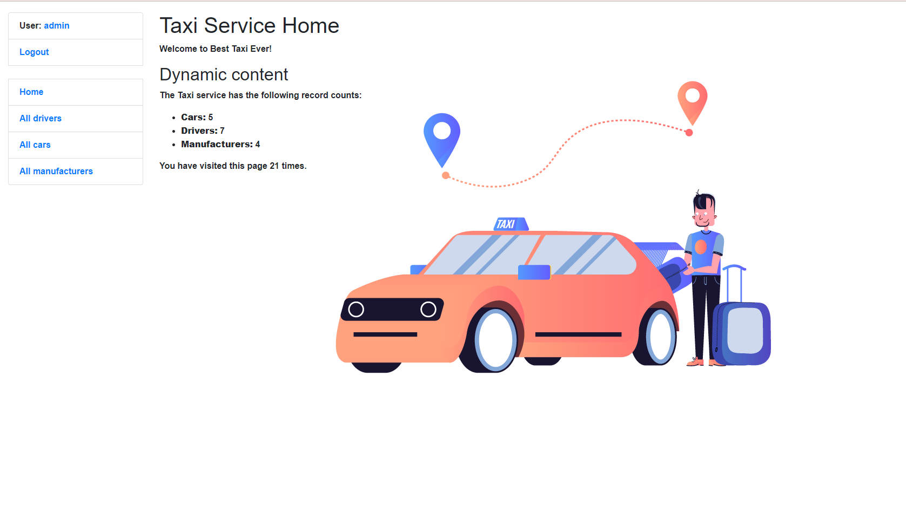
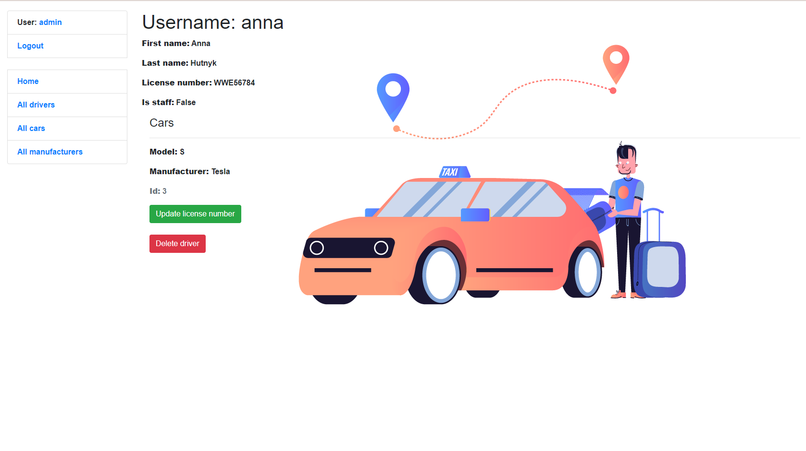

# Taxi service

Django project for managing taxi service

## Check it out!

https://taxi-service-hector.herokuapp.com/

## Installation

Python3 must be already installed

```shell
git clone https://github.com/Hectorovich/taxi-service
cd taxi-service
python -m venv venv
venv/scripts/activate
pip install -r requirements.txt
python manage.py runserver  # start Django project
```

## Features

* Managing drivers, cars, manufacturers directly from website
* Authentication functionality for Driver/User
* Powerful admin panel for advanced managing

## Demo



